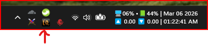
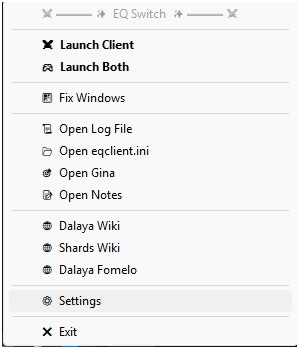
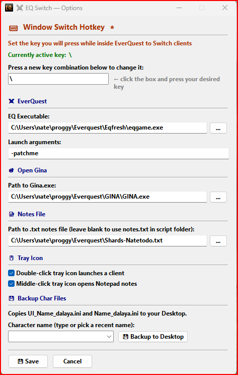
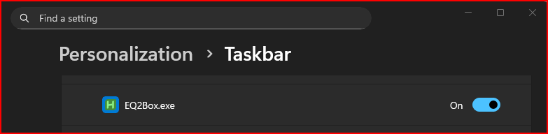

# ⚔ EQ Switch

**EQ Switch** is a lightweight Windows tray utility for **Shards of Dalaya** that lets you instantly flip between multiple game clients with a single keypress — plus a handful of handy tools for managing your session.

> Built with AutoHotkey v2. No installation required. Single `.exe`, no system footprint.

---

## 📸 Screenshots

| Tray Menu | Settings |
|:---:|:---:|
|  |  |
|  |  |

---

## 📥 Download & Install

1. Go to the [**Releases**](../../releases) page and download the latest `EQSwitch.exe`
2. Drop it anywhere you want — your game folder, Desktop, wherever
3. Optionally place `eqbox.ico` in the same folder for the custom tray icon
4. Double-click `EQSwitch.exe` to run it — it lives in your system tray
5. **Right-click the tray icon → Settings** and set up your switch hotkey

That's it. No installer, no registry entries, nothing left behind if you delete it.

---

## 🚀 First Time Setup

When you run EQ Switch for the first time with no config file, it will automatically open Settings and show you a welcome tooltip. **The most important thing to set is your Switch Hotkey** — it's the whole point of the program.

### Recommended setup steps:
1. **Set your Switch Hotkey** — the key you'll press in-game to jump between windows. Most people use `\` (backslash)
2. **Set your EQ Executable** — point it at your `eqgame.exe`
3. Hit **Save**

Everything else is optional and can be configured later.

---

## ⌨ How the Window Switch Works

Once running, press your configured hotkey **while the game is the active window** and EQ Switch will instantly bring your other EQ client to the front. It cycles through all visible EQ windows in order, so it works with 2+ clients.

> The hotkey **only fires in-game** — it won't interfere with anything else on your PC.

---

## 🖱 Tray Menu Features

Right-click the tray icon to access everything:

| Menu Item | What it does |
|---|---|
| **⚔ Launch Client** | Launches one EQ client |
| **🎮 Launch Both** | Launches N clients (configurable), waits for them to load, then arranges windows |
| **🚀 Launch Profile** | Quick-launch a saved character profile with its own settings |
| **🪟 Fix Windows** | Arranges all open EQ windows (maximize, restore, or side-by-side) |
| **🔄 Swap Windows** | Rotates EQ window positions — swaps which client is on which monitor |
| **🪟 Window Presets** | Save/load named window layouts |
| **📺 Picture-in-Picture** | Toggle live preview overlay of alt EQ windows |
| **⚡ Process Manager** | View and configure EQ process priority and CPU affinity |
| **📜 Open Log File** | Opens an EQ character's log file in Notepad (prompts for char name) |
| **📂 Open eqclient.ini** | Opens eqclient.ini from your EQ folder in Notepad |
| **🎯 Open Gina** | Launches Gina trigger app (path configured in Settings) |
| **📝 Open Notes** | Opens your notes .txt file in Notepad |
| **🌐 Dalaya Wiki** | Opens https://wiki.dalaya.org/ in your browser |
| **🌐 Shards Wiki** | Opens https://wiki.shardsofdalaya.com in your browser |
| **🌐 Dalaya Fomelo** | Opens https://dalaya.org/fomelo/ in your browser |
| **⚙ Settings** | Opens the Options window |
| **✖ Exit** | Closes EQ Switch |

---

## ⚙ Settings / Options

### ⌨ Window Switch Hotkey ⭐
The core feature. Set the key you'll press in-game to switch between clients. The current active key is shown in green so you always know what's bound.

### ⚔ EQ Settings
- **EQ Executable** — path to your `eqgame.exe`
- **Launch Arguments** — defaults to `-patchme`, change if your server needs something different
- **Server Name** — used for log/ini file paths (default: `dalaya`). Change if you play on a different server

### 🎮 Launch Options
- **Number of clients** — how many clients "Launch Both" starts (default: 2)
- **Window arrangement** — what happens after launch: `maximize` (default), `restore`, `sidebyside`, or `multimonitor`
  - `multimonitor` distributes one EQ window per monitor, maximized — ideal for dual-monitor boxing
- **Multi-monitor toggle hotkey** — a global hotkey (default: Right Alt + M) that cycles through: spread windows across monitors → swap which client is on which monitor → stack all back on primary. Works outside the game window
- **Launch One / Launch All hotkeys** — optional global hotkeys to launch clients from anywhere, even when EQ isn't focused
- **Top/Bottom offset** — fine-tune pixel offsets for Fix Windows and multi-monitor mode. Top offset adjusts Y start; bottom offset extends into the taskbar zone

### 🪟 Window Presets
Save and restore named window layouts (position + size for each client). Save your current arrangement, then reload it anytime from the tray menu or Settings. Goes beyond Fix Windows for custom multi-window setups.

### ⚡ Process Manager
Dedicated window showing all running EQ processes with PID, priority, and CPU affinity. Configure which CPU cores eqgame.exe can use (useful since EQ defaults to a single core). Settings are applied automatically on future launches, or you can apply them to already-running clients.

- **Process priority** — set eqgame.exe to Normal, AboveNormal, or High priority on launch
- **CPU affinity** — select which CPU cores EQ can use via checkboxes

### 📺 Picture-in-Picture
Live preview overlay of your alt EQ windows using DWM thumbnails. Toggle via the tray menu. The overlay is click-through and semi-transparent, positioned in the bottom-right corner. Automatically updates when you switch between EQ windows to always show your alt client(s).

### 🎯 Open Gina
Set the path to `Gina.exe` so the tray menu can launch it directly.

### 📝 Notes File
Point to any `.txt` file to use as your in-game notes. Leave blank and EQ Switch will create a `notes.txt` in its own folder. Middle-clicking the tray icon can open this file instantly (see Tray Icon options).

### 🖱 Tray Icon
- **Double-click launches a client** — double-clicking the tray icon launches one EQ client instead of opening Settings
- **Middle-click opens Notepad notes** — middle-clicking the tray icon opens your notes file directly
- **Run at Windows startup** — automatically start EQ Switch when you log in

### 📋 Character Profiles & Backup
Copies your character's UI and settings files to/from your Desktop with one click:
- `UI_CharName_server.ini` — your custom UI layout
- `CharName_server.ini` — your character settings

Type a character name or pick from the recent names dropdown, then hit **Backup** or **Restore**. Restore will prompt for confirmation before overwriting. Recent names are saved between sessions. Use the **✕** button to remove a name from the recent list.

#### Profiles
Save your frequently-used character groups as named profiles (e.g., "Raid Duo", "Farm Team"). Profiles let you:
- **Load** a profile to populate the character dropdown with that group
- **Backup All** / **Restore All** to batch-backup or restore every character in the profile at once
- **Save As...** to save your current recent characters list as a new profile
- **Delete** to remove a saved profile
- **Launch Profile** — profiles store their own client count and window mode. Use the "Launch Profile" tray submenu to launch with profile-specific settings in one click
- **Custom eqclient.ini** — each profile can use its own eqclient.ini file. Run your main at full graphics and alts at potato mode. The custom ini is swapped in before launch and the original is automatically restored after

---

## 📁 Files

| File | Purpose |
|---|---|
| `EQSwitch.exe` | The main program — this is all you need |
| `eqbox.ico` | Tray icon (optional, place next to the exe) |
| `eqswitch.cfg` | Auto-created config file, stores all your settings |
| `notes.txt` | Auto-created if you use the Notes feature without setting a custom path |
| `EQSwitch.ahk` | Source code (AutoHotkey v2) |

---

## 🔧 Running from Source

If you'd rather run the `.ahk` directly instead of the compiled exe:

1. Install [AutoHotkey v2](https://www.autohotkey.com/) (v2.x, **not** v1)
2. Double-click `EQSwitch.ahk`

To compile it yourself (using the bundled `Ahk2Exe.exe` in this folder):
```
./Ahk2Exe.exe /in EQSwitch.ahk /icon eqbox.ico /compress 0
```
> **Git Bash users:** AHK's `/in`, `/out`, `/icon` flags get mangled by MSYS path conversion. Prefix the command with `MSYS_NO_PATHCONV=1` to fix it.

The `/compress 0` flag avoids Windows Defender false positives (see FAQ). Make sure you select **AutoHotkey v2** as the base file in Ahk2Exe — using v1 will give a syntax error.

---

## ❓ FAQ

**Q: Windows says the file is from an unknown publisher — is it safe?**
Yes. EQ Switch is an unsigned personal tool. Click *More info → Run anyway* on the SmartScreen prompt. You can inspect the full source code in `EQSwitch.ahk`.

**Q: Windows Defender / my antivirus flagged EQSwitch.exe — is it a virus?**
No. AutoHotkey-compiled executables are frequently flagged as false positives by heuristic AV engines because the packaging technique (bundling an interpreter + script into a single exe) is also used by some malware. The exe is compiled with `/compress 0` to minimize these detections. You can verify the source yourself in `EQSwitch.ahk`, or run it from source directly with AutoHotkey v2 installed.

**Q: The switch hotkey isn't working**
Make sure the game is the **active/focused** window when you press it — the hotkey is intentionally scoped to only fire inside EQ so it doesn't conflict with other apps.

**Q: Settings stopped opening / tray clicks aren't working**
This was a known bug that's been fixed. If it happens, just close and reopen EQ Switch. The root cause (settings flag getting stuck) is now handled by closing with X, Escape, or Save all resetting properly.

**Q: Can I use this with more than 2 EQ clients?**
Yes! It cycles through all visible EQ windows in order. Just keep pressing your switch key to rotate through them.

**Q: Where is my config saved?**
In `eqswitch.cfg` next to the exe, as a plain INI file you can read or edit manually. Note: AutoHotkey's `IniWrite` may save this file in UTF-16 encoding — this is normal and the file can still be opened in Notepad or any text editor.

**Q: I updated from an older version and my settings were lost**
Older versions used the section name `[EQ2Box]` in the config file. v1.2+ automatically migrates your settings to the new `[EQSwitch]` section on first run — no action needed.

**Q: Can I configure launch delays or other advanced settings?**
Yes. Open `eqswitch.cfg` in a text editor and look for `LAUNCH_DELAY` (ms between client launches, default 3000) and `LAUNCH_FIX_DELAY` (ms before window arrangement, default 15000).

---

## 💬 Credits

Long Live Dalaya! ⚔

---

## 📜 License

MIT License — see [LICENSE](LICENSE) for details.
