# EQSwitch

EverQuest multiboxing window manager for [Shards of Dalaya](https://dalaya.org)

[](https://github.com/itsnateai/eqswitch/releases)
[](LICENSE)
[](https://dotnet.microsoft.com/)
[](https://github.com/itsnateai/eqswitch)
[](https://github.com/itsnateai/eqswitch/releases)

---

> **Fan-made educational project.** EQSwitch is an independent, open-source utility built for educational and personal-use purposes, and it is free — always. It is not affiliated with, endorsed by, or connected to Daybreak Game Company, Darkpaw Games, or the Shards of Dalaya team. EverQuest is a registered trademark of Daybreak Game Company LLC. This tool does not distribute, modify, or host any game content — it is a client-side window manager only.

A lightweight EverQuest multiboxer — hotkey switching, encrypted auto-login, PiP overlays, CPU affinity, multi-monitor support, and zero-telemetry privacy for Shards of Dalaya.

## Download

**[Download EQSwitch.zip](https://github.com/itsnateai/eqswitch/releases/latest/download/EQSwitch.zip)** — extract and run. No installer, no runtime needed. _(Or browse [all releases](https://github.com/itsnateai/eqswitch/releases/latest).)_

> [!TIP]
> Extract the zip to any folder and run `EQSwitch.exe` — it lands in a consistent `EQSwitch` folder. Config is stored as `eqswitch-config.json` next to the exe.

<details>
<summary>What's in the zip?</summary>

| File | Size | Purpose |
|------|------|---------|
| **EQSwitch.exe** | ~180 MB | Main app (self-contained, no .NET runtime needed) |
| **eqswitch-hook.dll** | ~135 KB | Window management hooks (SetWindowPos/MoveWindow) |
| **eqswitch-di8.dll** | ~248 KB | DirectInput hooks + login state machine for background auto-login |
| **uninstall.bat** | ~10 KB | GUI-less uninstaller — reverts external changes |
| **LICENSE**, **README.md**, **CHANGELOG.md** | small | License, this readme, version history |

Keep `EQSwitch.exe` and the two `.dll` files together in one folder. A separate `SHA256SUMS` file is published alongside the zip on each release for integrity verification.

</details>

## Screenshots

<details open>
<summary><b>Screenshots</b> — click to collapse · 12 images: tray, settings, PiP, window styling · <i>click any thumbnail to open full-size in a new tab</i></summary>

<table>
<tr>
<td align="center"><a href="docs/img/eqswitchtray1.png" target="_blank" rel="noopener">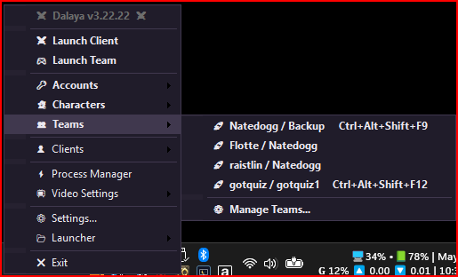</a><br><sub>Tray — main</sub></td>
<td align="center"><a href="docs/img/eqswitchtray2.png" target="_blank" rel="noopener">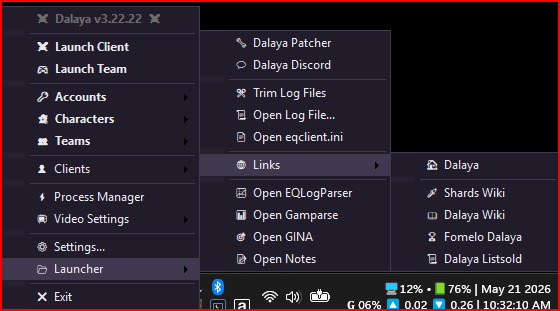</a><br><sub>Tray — accounts</sub></td>
<td align="center"><a href="docs/img/eqswitchtray3.png" target="_blank" rel="noopener">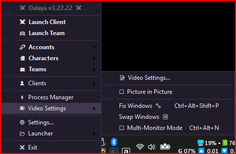</a><br><sub>Tray — teams</sub></td>
</tr>
<tr>
<td align="center"><a href="docs/img/eqswitchsettings.png" target="_blank" rel="noopener">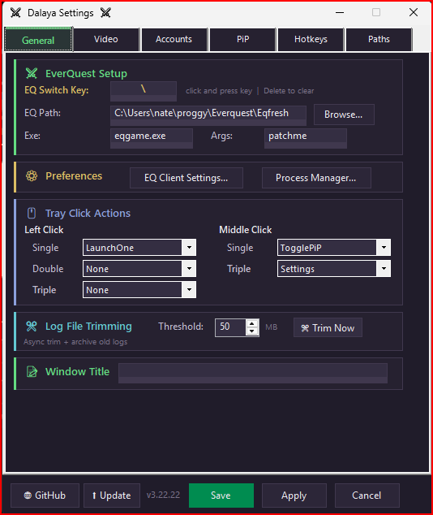</a><br><sub>Settings — General</sub></td>
<td align="center"><a href="docs/img/eqswitchhotkeys.png" target="_blank" rel="noopener">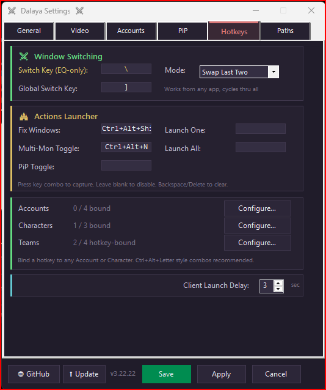</a><br><sub>Settings — Hotkeys</sub></td>
<td align="center"><a href="docs/img/eqswitchaccounts.png" target="_blank" rel="noopener">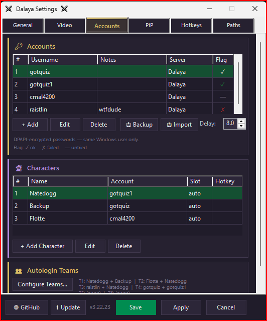</a><br><sub>Settings — Accounts (DPAPI)</sub></td>
</tr>
<tr>
<td align="center"><a href="docs/img/eqswitchpaths.png" target="_blank" rel="noopener">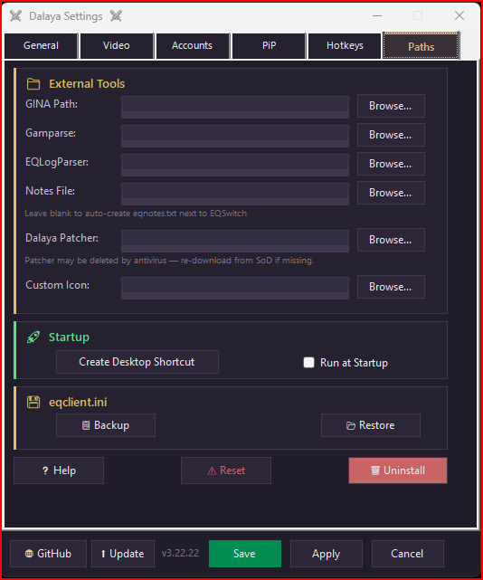</a><br><sub>Settings — Paths</sub></td>
<td align="center"><a href="docs/img/eqswitchpip.png" target="_blank" rel="noopener">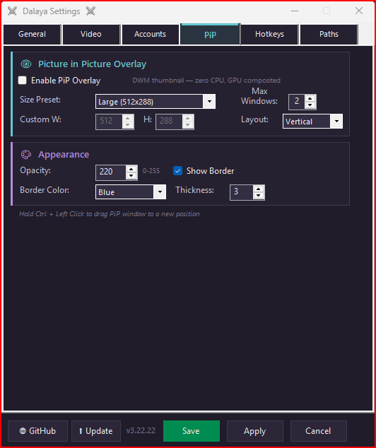</a><br><sub>PiP overlay (DWM)</sub></td>
<td align="center"><a href="docs/img/eqswitchautologinteams.png" target="_blank" rel="noopener">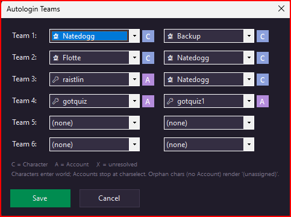</a><br><sub>Auto-login — teams</sub></td>
</tr>
<tr>
<td align="center"><a href="docs/img/eqswitchvideo.png" target="_blank" rel="noopener">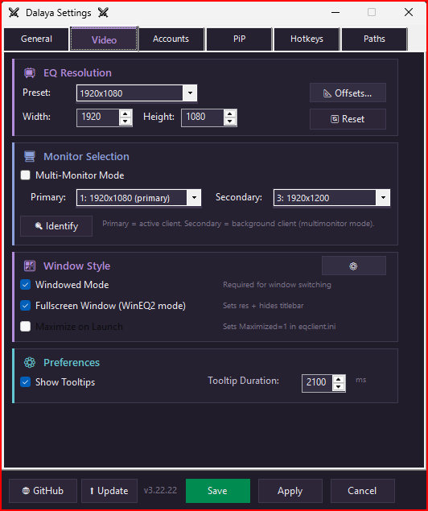</a><br><sub>Video / eqclient.ini</sub></td>
<td align="center"><a href="docs/img/eqswitcheqclient.png" target="_blank" rel="noopener">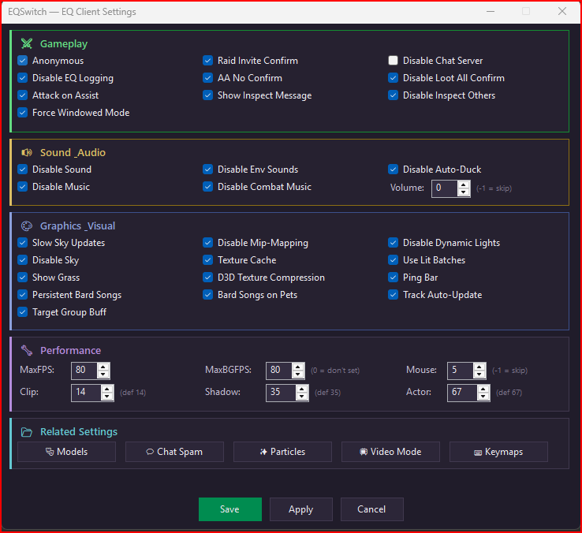</a><br><sub>eqclient.ini editor</sub></td>
<td align="center"><a href="docs/img/eqswitchcpupriority.png" target="_blank" rel="noopener">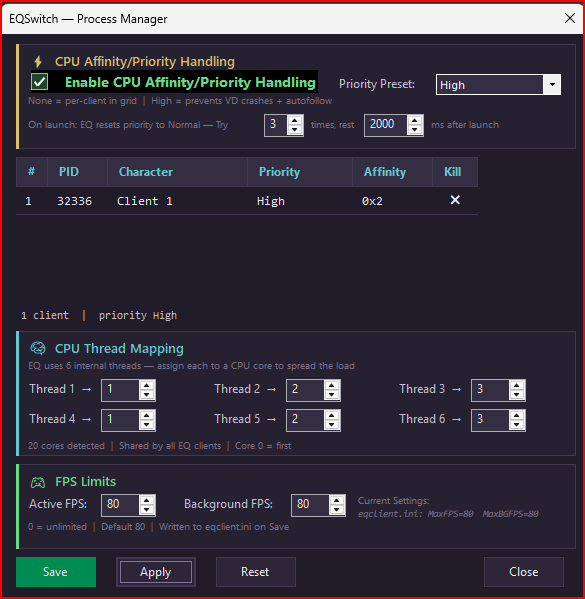</a><br><sub>CPU priority + affinity</sub></td>
</tr>
</table>

</details>

## Features

- **Window Switching** — Cycle EQ clients with hotkeys (keyboard hook for single keys, RegisterHotKey for combos)
- **Fullscreen Window** — WinEQ2-style borderless mode that hides the titlebar above the screen edge
- **DLL Hook Injection** — Hooks SetWindowPos/MoveWindow inside eqgame.exe for zero-flicker window positioning
- **Multi-Monitor** — One client per physical monitor with automatic arrangement
- **Process Priority** — Both active and background EQ clients default to AboveNormal (configurable per-character)
- **CPU Core Assignment** — CPUAffinity0-5 slots written to eqclient.ini for per-client core pinning
- **PiP Overlay** — Live DWM thumbnail previews (zero CPU, GPU composited). Vertical or horizontal layout, 6 size presets (Small / Medium / Large / XL / XXL / XXXL) + custom dimensions
- **Staggered Launch** — Multi-client launch with configurable delay and auto-arrange
- **Settings GUI** — Dark-themed tabbed settings (General, Video, Accounts, PiP, Hotkeys, Paths)
- **EQ Client Settings** — Sub-forms for editing eqclient.ini (Video, Key Mappings, Chat, Particles, Models)
- **Video Settings** — Resolution presets, custom presets, windowed mode enforcement
- **Configurable Tray Actions** — Left/double/middle click actions are fully customizable
- **Character Profiles** — Per-character priority overrides, export/import
- **Custom Tray Icon** — Custom .ico support
- **Auto-Login** — Encrypted account presets with one-click launch, login, server select, and character enter world
- **Background Auto-Login** — Logs each client in while the window stays in the background — no focus stealing, no game file modifications
- **Self-Updater** — Built-in update check against GitHub Releases. Downloads the new zip, verifies SHA256, replaces all three binaries in place (no installer to re-run)
- **Portable** — One zip, extract anywhere, config stored next to the exe — no installer needed
- **Privacy First** — Zero telemetry, no network calls, no data collection. Saved passwords are encrypted with Windows DPAPI and can only be decrypted by your Windows account on your machine

## Requirements

- Windows 10/11

## Default Hotkeys

| Hotkey | Action |
|--------|--------|
| `\` | Switch client — swap-last (default) or cycle-all, depending on Switch Key Mode in Settings → Hotkeys. Only fires when EQ is focused. |
| `]` | Global switch — same mode as above, but also brings EQ to front when another app is focused |
| Ctrl+Alt+N | Toggle single-screen / multi-monitor mode |

### Tray Icon Actions (all configurable in Settings → General)

| Action | Default | Notes |
|--------|---------|-------|
| Right-click | Context menu | Not user-configurable |
| Single-click | (none) | Configurable |
| Double-click | Launch one EQ client | Configurable |
| Triple-click | (none) | Configurable |
| Middle-click | Toggle PiP overlay | |
| Middle-double-click | Open Settings | Two middle-clicks, not three |

## Config

Config is stored as `eqswitch-config.json` alongside the exe (portable). Auto-backups are created in a `backups/` subfolder (last 10 kept).

### Custom Tray Icon

EQSwitch ships with a built-in tray icon. To use your own instead, open **Settings → Paths** and point the **Custom Icon** field at any `.ico` file — EQSwitch loads it on the next launch (or after you click Apply).

### Process Priority Defaults

- **Active client**: AboveNormal priority
- **Background clients**: AboveNormal priority
- Per-character priority overrides in Settings → Characters
- CPU core assignment via eqclient.ini CPUAffinity0-5 slots (Settings → Process Manager)

## Auto-Login Security

Passwords are encrypted using **Windows DPAPI** (Data Protection API) via `ProtectedData.Protect` with `DataProtectionScope.CurrentUser`, and stored locally in your config file. Here's what that means:

- **User-scoped** — Only your Windows user account on your machine can decrypt the passwords. Other users on the same PC (even administrators) cannot read them. The decryption key is derived from your Windows account credentials by the OS — EQSwitch never sees it
- **Zero network traffic** — Encryption and decryption happen entirely on your machine. Passwords are never transmitted anywhere
- **No master password** — Your Windows login IS the master key. The OS-managed key material lives in `%APPDATA%\Microsoft\Protect\{SID}\`
- **Stored as base64** — The encrypted blob is base64-encoded in `eqswitch-config.json`. Even if someone reads the file, they see gibberish without your Windows credentials

> [!IMPORTANT]
> If you reinstall Windows or create a new user account, stored passwords cannot be recovered. You'll need to re-enter them in Settings.

## eqclient.ini Handling

EQSwitch never writes to your `eqclient.ini` automatically. Whenever you open Settings → Video (or any of the EQ Client Settings sub-forms — Key Mappings, Chat, Particles, Models, VideoMode), EQSwitch reads your *current* `eqclient.ini` so the form reflects your real values, not generic defaults that could silently overwrite your manual INI edits.

Changes are **not written back** until you explicitly click Save in the EQ Client Settings form.

## Troubleshooting

| Issue | Solution |
|-------|----------|
| **Hotkeys not working** | Run as Administrator — some games need elevated privileges for global hotkeys |
| **EQ path not detected** | Use Settings → Paths to set your EQ installation directory |
| **PiP not showing** | Requires 2+ EQ clients running. Middle-click tray icon to toggle |
| **CPU affinity not applying** | EQ resets affinity after launch — EQSwitch retries automatically. Use tray menu → Force Apply |
| **Config lost after moving exe** | Move `eqswitch-config.json` with the exe. Backups in `backups/` subfolder |
| **DLL blocked by antivirus** | Add your EQSwitch folder to Windows Defender exclusions |

## Uninstall / Clean Up

EQSwitch can be fully removed without leaving traces:

**From the GUI:** Settings → Paths tab → **Uninstall** button

This reverts all external system changes:
- Restores Dalaya's `dinput8.dll` if a legacy proxy was renamed during the chain-load era
- Removes legacy EQSwitch DLL artifacts from the EQ folder (size-detected — never touches Dalaya's MQ2 core)
- Removes the startup shortcut
- Removes the desktop shortcut
- Removes the legacy `HKCU\...\Run\EQSwitch` registry entry from pre-shortcut versions

**Fallback:** if the GUI won't launch, run `uninstall.bat` from the EQSwitch folder. It mirrors the GUI logic.

Your `eqclient.ini` settings and EQSwitch config files are **not** modified — restore from `.bak` files in your EQ folder if needed.

> [!TIP]
> After running uninstall, you can delete the entire EQSwitch folder to complete the removal.

## Supporting This Project

This app is free and open source. If it saves you time, consider supporting continued development:

<p>
  <a href="https://buymeacoffee.com/itsnate"></a>
</p>

- **[Buy Me a Coffee](https://buymeacoffee.com/itsnate)** — one-time support

You can also build from source for free — see the build instructions below.

---

<sub>↓ Technical details, building from source, and project internals below.</sub>

## Background Auto-Login

When **Background Login** is enabled (Settings → Accounts), EQSwitch logs each EQ client in for you — password, server select, and character enter-world — without ever bringing the window to the foreground. One click, every account in.

<details>
<summary>How it works (the short version)</summary>

EQSwitch starts each EQ client paused, slips two small helper DLLs in before the game runs, and hands the password to the login screen directly in memory — so EQ logs in as if you'd typed it, even while the window is in the background. Nothing is written to your EQ folder; the helpers live next to EQSwitch.exe and load only at runtime.

</details>

> [!NOTE]
> No files are deployed to your EQ directory. The DLLs are injected at runtime and live alongside EQSwitch.exe.

> [!WARNING]
> Windows Defender may flag the injectable DLLs as suspicious (DLL injection is a common game-tool technique). Add your EQSwitch folder to Defender's exclusion list if DLLs are blocked or quarantined.

## Build from Source

```bash
git clone https://github.com/itsnateai/eqswitch.git
cd eqswitch

# Build the native hook DLL (32-bit x86 target)
# MinGW (Git Bash):
bash Native/build.sh
# OR MSVC (from a Developer Command Prompt for VS):
# Native\build.cmd

# Build the DirectInput injectable DLL (32-bit x86)
bash Native/build-di8-inject.sh

# Self-contained single-file (~180 MB, no runtime needed)
dotnet publish -c Release -r win-x64 --self-contained -p:PublishSingleFile=true
```

Output: `bin/Release/net8.0-windows/win-x64/publish/EQSwitch.exe` + `eqswitch-hook.dll` + `eqswitch-di8.dll`

## Project Structure

| Path | Description |
|------|-------------|
| `Program.cs` | Entry point — single-instance mutex, first-run setup |
| `Core/` | Win32 interop, process management, hotkeys, DLL injection, shared memory |
| `Config/` | JSON config model, load/save, AHK migration |
| `Models/` | EQ client data model |
| `UI/` | Tray manager, settings GUI, PiP overlay, dark theme, process manager |
| `Native/` | C++ DLL sources — eqswitch-hook (MinHook) + eqswitch-di8 (DirectInput + IAT hooks), 32-bit x86 |

---

## License

[GPL-2.0-or-later](LICENSE) — GNU General Public License, version 2, or (at your option) any later version.

### Attribution

- **Stonemite** ([`eqlaika/stonemite`](https://github.com/eqlaika/stonemite)) — DirectInput proxy architecture studied (GPLv3). No code was taken; the approach was reimplemented independently.
- **MacroQuest (MQ2)** — Character-select integration facts (offsets, struct layouts, IPC patterns) referenced. No MQ2 source is compiled into EQSwitch; the two communicate across a shared-memory boundary only.
- **MinHook (by Tsuda Kageyu, 2009–2017)** — x86/x64 inline-hook library. Bundled in-tree under `Native/` (`MinHook.h`, `buffer.c/.h`, `hook.c`, `trampoline.c/.h`). Distributed under its original BSD 2-Clause license, which is preserved verbatim in each source file.
- **HDE32 / HDE64 (by Vyacheslav Patkov, 2006–2009)** — Length-disassembler tables used by MinHook's trampoline builder. Vendored by MinHook upstream; original headers retained in-tree without modification. Used in-situ as part of MinHook; EQSwitch does not redistribute it independently.

### Why GPL-2.0-or-later?

EQSwitch lives inside the broader EverQuest tool ecosystem, which is uniformly GPLv2-only (MacroQuest and every MQ2 plugin). GPL-2.0-or-later keeps that door open while remaining upward-compatible with GPLv3 for anyone who wants it. This is a free, fan-made educational project — the license choice is about ecosystem interop, not commercialization.
