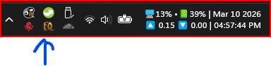
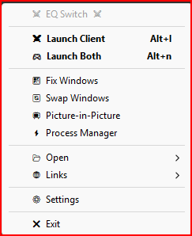
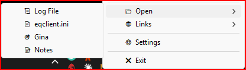
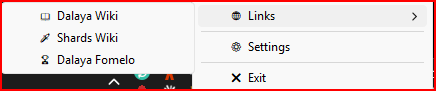
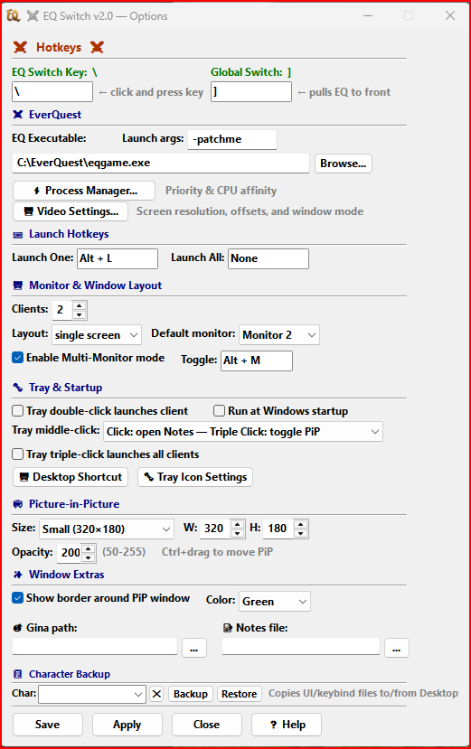
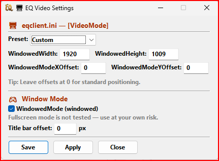
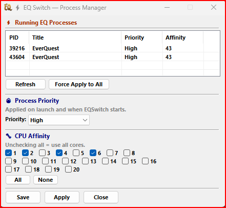
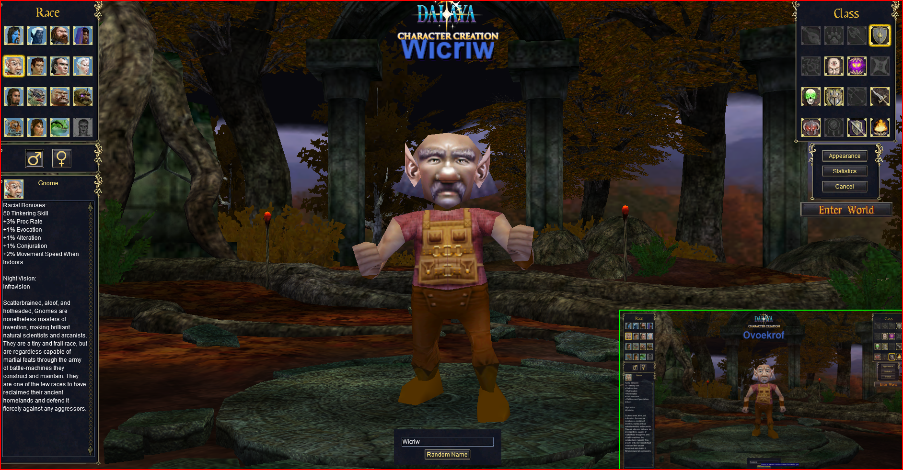
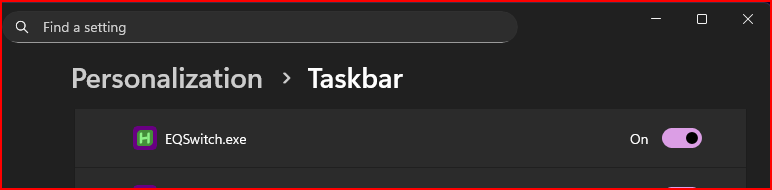

# ⚔ EQ Switch

**EQ Switch** is a lightweight Windows tray utility for **Shards of Dalaya** that lets you instantly flip between multiple game clients with a single keypress — plus a suite of tools for managing your multibox session.

> Built with AutoHotkey v2. No installation required. Single `.exe`, no system footprint.

---

## 📸 Screenshots

| Tray Icon | Tray Menu |
|:---:|:---:|
|  |  |

| Open Submenu | Links Submenu |
|:---:|:---:|
|  |  |

| Settings |
|:---:|
|  |

| Video Settings | Process Manager |
|:---:|:---:|
|  |  |

| Picture-in-Picture |
|:---:|
|  |

| Hidden Taskbar Mode |
|:---:|
|  |

---

## 📥 Download & Install

1. Go to the [**Releases**](../../releases) page and download the latest `EQSwitch.exe`
2. Drop it anywhere you want — your game folder, Desktop, wherever
3. Double-click `EQSwitch.exe` to run it — it lives in your system tray
4. **Right-click the tray icon → Settings** and set up your switch hotkey

That's it. No installer, no registry entries, nothing left behind if you delete it.

---

## 🚀 First Time Setup

When you run EQ Switch for the first time with no config file, it will automatically open Settings and show you a welcome tooltip. **The most important thing to set is your Switch Hotkey** — it's the whole point of the program.

### Recommended setup steps:
1. **Set your Active Key** — the key you'll press in-game to jump between windows (default: `\`)
2. **Set your EQ Executable** — point it at your `eqgame.exe`
3. Hit **Save**

Everything else is optional and can be configured later.

---

## ⌨ How the Window Switch Works

Press your configured **Active Key** (default `\`) **while the game is the active window** and EQ Switch will instantly bring your other EQ client to the front. It cycles through all visible EQ windows in order, so it works with 2+ clients.

The **Global Switch** hotkey (default `]`) works from anywhere — even outside the game — and pulls EQ to the front. Press it again to cycle between clients.

> Both hotkeys are configurable in Settings under the Hotkeys section.

---

## 🖱 Tray Menu Features

Right-click the tray icon to access everything:

| Menu Item | What it does |
|---|---|
| **⚔ Launch Client** | Launches one EQ client |
| **🎮 Launch Both** | Launches N clients (configurable), waits for them to load, then arranges windows |
| **🪟 Fix Windows** | Arranges all open EQ windows based on your mode (single screen or multimonitor) |
| **🔄 Swap Windows** | Swaps EQ window positions between monitors |
| **📺 Picture-in-Picture** | Toggle live PiP overlay of your alt EQ windows |
| **⚡ Process Manager** | View and configure EQ process priority and CPU affinity |
| **📂 Open** | Submenu: Log File, eqclient.ini, Gina, Notes |
| **🌐 Links** | Submenu: Dalaya Wiki, Shards Wiki, Dalaya Fomelo |
| **⚙ Settings** | Opens the Settings window |
| **✖ Exit** | Closes EQ Switch |

### Tray Icon Actions:
- **Left double-click** — launches one EQ client
- **Middle-click** — opens Notes or toggles PiP (configurable)
- **Middle triple-click** — the other action (Notes/PiP toggle)

---

## ⚙ Settings

### ⌨ Hotkeys
- **Active Key** (default `\`) — switches between EQ clients when the game is focused. Cycles through all visible EQ windows
- **Global Switch** (default `]`) — pulls EQ to the front from any app. Press again to cycle between clients
- **Fix Mode Toggle** (`Alt+M`) — simple on/off toggle for multimonitor mode, saved to config

### ⚔ EverQuest
- **EQ Executable** — path to your `eqgame.exe` with launch arguments (default: `-patchme`)
- **Server Name** — used for log/ini file paths (default: `dalaya`)
- **Process Manager** — dedicated window showing all running EQ processes with PID, priority, and CPU affinity controls
- **Video Settings** — screen resolution, window mode, and offset configuration (see below)

### 🎮 Launch Options
- **Number of clients** — how many clients "Launch Both" starts (default: 2)
- **Fix mode** — what happens after launch and when pressing Fix Windows:
  - `single screen` — maximizes EQ on your primary monitor
  - `multimonitor` — distributes one EQ window per monitor, maximized
- **Target monitor** — which monitor gets the first EQ window in multimonitor mode (default: 2)
- **Title Bar Offset** — pushes the window down to hide the title bar behind the top edge of the screen

### 📺 Picture-in-Picture
Live preview overlay of your alt EQ windows using DWM thumbnails:
- **Click-through** — clicks pass straight through to the window underneath
- **Ctrl+drag** to reposition the PiP window
- **Thin colored border** — toggle and color configurable in Settings
- **Size presets** — S, M, L, XL, XXL
- Position is saved and restored between sessions
- Max 3 thumbnails, automatically updates when you switch clients

### 🎬 Video Settings
Configure EQ's display settings without manually editing `eqclient.ini`:
- **Resolution presets** — 1920x1009, 1920x1080, 1920x1200, 1920x1280, 2560x1440, 1280x720, or custom
- **Window offsets** — X, Y, Width, Height offsets for fine-tuning window placement
- **Windowed Mode** — toggle between windowed and fullscreen via checkbox
- Custom values are stashed when switching presets and restored when selecting "Custom"

### ⚡ Process Manager
Dedicated window showing all running EQ processes:
- **Process priority** — Normal, AboveNormal, or High
- **CPU affinity** — select which cores EQ can use via checkboxes
- **Force Apply** — apply settings to already-running clients
- Settings are automatically applied on future launches

### 🎯 Gina
Set the path to `Gina.exe` so the tray menu can launch it directly.

### 📝 Notes File
Point to any `.txt` file to use as your in-game notes. Leave blank and EQ Switch will create a `notes.txt` in its own folder.

### 📋 Character Backup
Copies your character's UI and settings files to/from your Desktop:
- `UI_CharName_server.ini` — your custom UI layout
- `CharName_server.ini` — your character settings

Type a character name or pick from the recent names dropdown, then hit **Backup** or **Restore**.

### 🖱 Tray Behavior
- **Double-click action** — launches a client
- **Middle-click / triple-click** — configurable between Notes and PiP toggle
- **Run at Windows startup** — automatically start EQ Switch when you log in

---

## ❓ Help

Press **Help** in the Settings window to open the built-in help guide with a full overview of all features and hotkeys.

---

## 📁 Files

| File | Purpose |
|---|---|
| `EQSwitch.exe` | The main program — this is all you need |
| `eqswitch.ico` | Tray icon (embedded in the exe, also available separately) |
| `eqswitch.cfg` | Auto-created config file, stores all your settings |
| `notes.txt` | Auto-created if you use the Notes feature without setting a custom path |
| `EQSwitch.ahk` | Source code (AutoHotkey v2) |

---

## 🔧 Running from Source

If you'd rather run the `.ahk` directly instead of the compiled exe:

1. Install [AutoHotkey v2](https://www.autohotkey.com/) (v2.x, **not** v1)
2. Double-click `EQSwitch.ahk`

To compile it yourself:
```
Ahk2Exe.exe /in EQSwitch.ahk /icon eqswitch.ico /compress 0
```
> **Git Bash users:** Prefix with `MSYS_NO_PATHCONV=1` — Git Bash mangles the `/in`, `/icon` flags without it.

The `/compress 0` flag avoids Windows Defender false positives (see FAQ).

---

## ❓ FAQ

**Q: Windows says the file is from an unknown publisher — is it safe?**
Yes. EQ Switch is an unsigned personal tool. Click *More info → Run anyway* on the SmartScreen prompt. You can inspect the full source code in `EQSwitch.ahk`.

**Q: Windows Defender flagged EQSwitch.exe — is it a virus?**
No. AutoHotkey-compiled executables are frequently flagged as false positives because the packaging technique (bundling an interpreter + script into a single exe) resembles some malware patterns. The exe is compiled with `/compress 0` to minimize detections. You can verify the source yourself or run from source directly.

**Q: The switch hotkey isn't working**
Make sure the game is the **active/focused** window when you press it — the Active Key only fires inside EQ. Use the Global Switch key (`]` by default) if you want to switch from outside the game.

**Q: Can I use this with more than 2 EQ clients?**
Yes! It cycles through all visible EQ windows in order. Just keep pressing your switch key to rotate through them.

**Q: Where is my config saved?**
In `eqswitch.cfg` next to the exe, as a plain INI file you can read or edit manually.

**Q: I updated from an older version and my settings were lost**
Older versions used the section name `[EQ2Box]` in the config file. v1.2+ automatically migrates your settings to the new `[EQSwitch]` section on first run — no action needed.

**Q: Can I configure launch delays?**
Yes. Open `eqswitch.cfg` in a text editor and look for `LAUNCH_DELAY` (ms between client launches, default 3000) and `LAUNCH_FIX_DELAY` (ms before window arrangement, default 15000).

---

## 💬 Credits

Long Live Dalaya! ⚔

---

## 📜 License

MIT License — see [LICENSE](LICENSE) for details.
